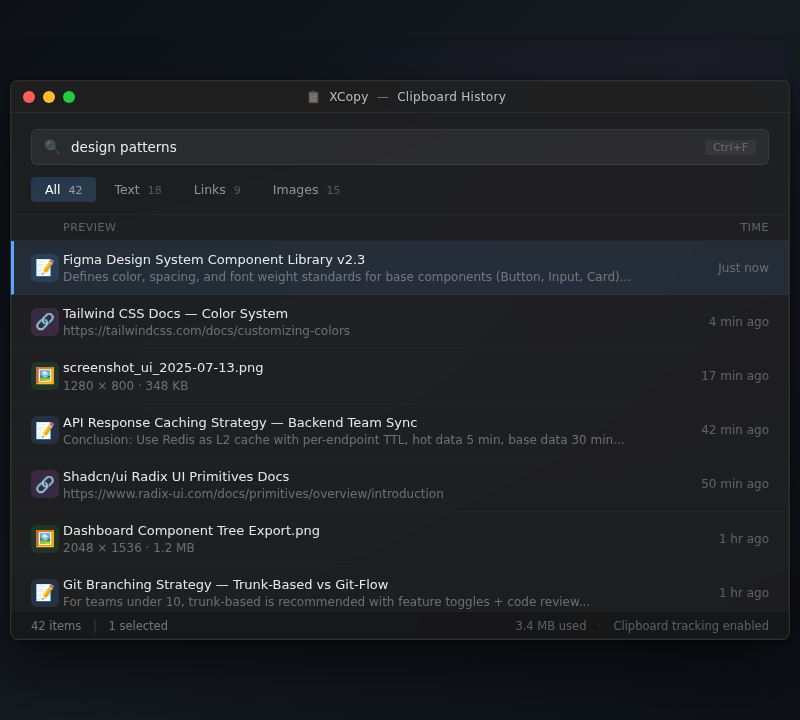
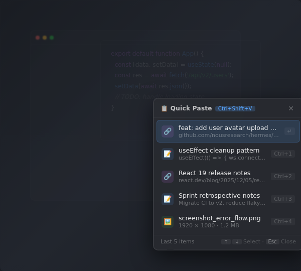
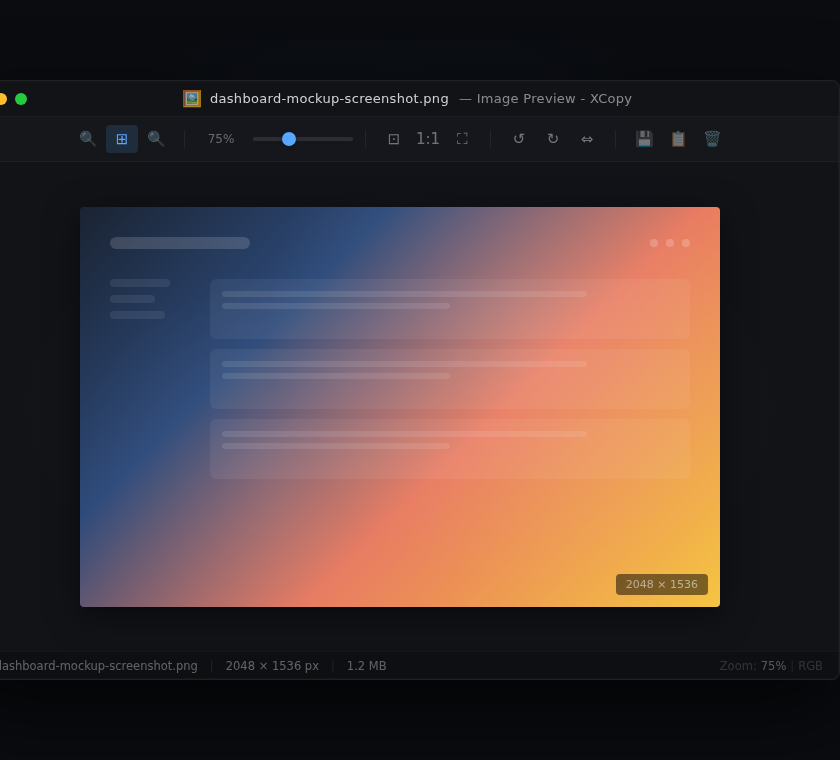

<div align="center">


# XCopy

### ✂️ Your clipboard, finally at your fingertips.

**A lightweight, blazing-fast Windows clipboard history manager — auto-capture texts, links & images, search instantly, paste in one click.**

[](https://github.com/yingjunnan/XCopy/actions)
[](LICENSE)
[](#-download--install)
[](https://v2.tauri.app)
[](https://www.rust-lang.org)
[](https://github.com/yingjunnan/XCopy/pulls)

[📥 Download](#-download--install) · [✨ Features](#-features) · [⚡ Keyboard Shortcuts](#-keyboard-shortcuts) · [📊 Comparison](#-comparison) · [🛠 Tech Stack](#-tech-stack) · [🇨🇳 中文](README.md)

</div>

---

## 📸 Screenshots

| Main Window | Quick Paste | Image Preview |
|:---:|:---:|:---:|
|  |  |  |

> *Screenshots coming soon — they will show the clipboard history panel, quick-paste popup, and image preview in action.*

---

## ✨ Features

| Icon | Feature | Description |
|:---:|---|---|
| 🖥️ | **Global Hotkey** | Press `Ctrl+Shift+V` anytime to summon the clipboard panel. Auto-hides on blur so it never gets in your way. |
| ⚡ | **Double-Tap Ctrl** | Double-tap Ctrl in any app to show a lightweight inline picker at your cursor. Select an item and it's pasted instantly — no extra `Ctrl+V` needed. |
| 📋 | **Auto Capture** | Texts, links, and images are automatically saved as you copy. Content-hash deduplication keeps your history clean. |
| 🔍 | **Search & Filter** | Filter by All / Text / Link / Image, or type keywords to find any item in an instant — even with hundreds of entries. |
| 🖼️ | **Image Preview** | Open images in a dedicated viewer with mouse-wheel zoom and drag-to-pan support. Perfect for screenshot details. |
| 🗄️ | **Lightweight Local Storage** | Powered by SQLite. Configurable retention up to 100,000 items and custom expiry days. Old data is auto-cleaned. |
| ⚙️ | **Full Settings** | Auto-start on boot, system tray residency, and customizable hotkey recording — all in one settings panel. |
| 📊 | **Disk Usage at a Glance** | The settings panel shows exactly how much space your database and cached images consume in real time. |

---

## ⚡ Keyboard Shortcuts

| Shortcut | Action |
|:---|---:|
| `Ctrl + Shift + V` | Open clipboard history panel |
| `Double-Tap Ctrl` | Quick-paste at cursor (inline mode) |
| `↑ / ↓` | Navigate through history items |
| `Enter` | Paste selected item |
| `Esc` | Close panel |
| `Mouse Scroll` | Zoom in/out on previewed image |
| `Drag` | Pan around zoomed image |

---

## 📊 Comparison

| Feature | **XCopy** 🏆 | Ditto | Win+V (PowerToys) | Paste (iOS) |
|:---|---:|:---:|:---:|:---:|
| Platform | Windows 10/11 | Windows | Windows | macOS/iOS |
| Open Source | ✅ MIT | ✅ GPL | ❌ | ❌ |
| Auto Capture | ✅ Text, Link, Image | ✅ Text, Image | ✅ Text only | ✅ Text, Image |
| Image Preview | ✅ Dedicated viewer | ❌ Basic | ❌ | ✅ |
| Quick-Paste (Double Ctrl) | ✅ | ❌ | ❌ | ❌ |
| Category Filter | ✅ 4 categories | ✅ Limited | ❌ | ❌ |
| Search | ✅ Instant keyword | ✅ | ✅ | ✅ |
| Max History | 100K+ | Configurable | Limited | Limited |
| Retention Policy | ✅ Days + count | ✅ Days only | ❌ | ❌ |
| Dark Mode | ✅ | ⚠️ (theme) | ✅ | ✅ |
| Tech Stack | Tauri + Rust + React | C++ (WinForms) | C# (UWP) | Swift (Native) |
| Bundle Size | ~8 MB | ~15 MB | Built-in ~30 MB | N/A |
| Auto-start | ✅ | ✅ | ✅ | N/A |

> **Why XCopy?** — Built with a modern, performant stack (Tauri + Rust + React), the smallest footprint of any clipboard manager, and a unique double-tap Ctrl quick-paste feature you won't find anywhere else.

---

## 🛠 Tech Stack

| Layer | Technology |
|:---|---:|
| 🖥️ Desktop Framework | [Tauri 2](https://v2.tauri.app/) |
| ⚛️ Frontend | React 18 + TypeScript + Vite |
| 🎨 Styling | Tailwind CSS + Framer Motion |
| 🦀 Backend | Rust |
| 🗃️ Storage | SQLite (rusqlite) |
| 📋 Clipboard | arboard + Win32 API |
| 📦 Installer | NSIS |

---

## 📥 Download & Install

**System Requirements:** Windows 10 / 11 (x64)

1. Go to the **[Releases](https://github.com/yingjunnan/XCopy/releases)** page
2. Download the latest `XCopy_*-setup.exe`
3. Double-click to install — the app will start automatically and live in your system tray
4. Press `Ctrl+Shift+V` to open your clipboard history

> 💡 The app auto-starts on login by default. You can change this in Settings.

---

## 🚀 Local Development

### Prerequisites

- [Node.js](https://nodejs.org/) 20+
- [Rust](https://www.rust-lang.org/tools/install) (stable)
- [Tauri 2 prerequisites](https://v2.tauri.app/start/prerequisites/) — WebView2 & MSVC build tools on Windows

### Quick Start

```bash
# Clone
git clone https://github.com/yingjunnan/XCopy.git
cd XCopy

# Install frontend dependencies
npm install

# Launch in dev mode (Vite + Tauri)
npm run tauri dev
```

### Build for Production

```bash
npm run tauri build
```

Artifacts will be at `src-tauri/target/release/bundle/`.

### Available Scripts

| Command | Description |
|:---|---:|
| `npm run dev` | Start Vite dev server only |
| `npm run build` | Build frontend to `dist/` |
| `npm run tauri dev` | Launch full Tauri dev mode |
| `npm run tauri build` | Build production installer |

---

## 📁 Project Structure

```
xcopy/
├── src/                      # Frontend (React + TypeScript)
│   ├── App.tsx               # Root component (history / settings views)
│   ├── preview.tsx           # Image preview window
│   ├── quick_paste.tsx       # Quick-paste inline panel
│   ├── onboarding.tsx        # First-run onboarding
│   ├── components/           # UI components
│   │   ├── ClipboardPanel.tsx
│   │   ├── ClipboardItem.tsx
│   │   ├── SettingsPanel.tsx
│   │   ├── SearchBar.tsx
│   │   ├── CategoryTabs.tsx
│   │   └── EmptyState.tsx
│   ├── hooks/                # React hooks
│   └── types/                # Type definitions
├── src-tauri/                # Rust backend
│   └── src/
│       ├── lib.rs            # Entry point, commands, tray, hotkeys
│       ├── clipboard.rs      # Clipboard monitoring & capture
│       ├── db.rs             # SQLite database operations
│       ├── app_settings.rs   # Settings read/write & auto-start
│       ├── models.rs         # Data models
│       ├── hotkey_hook.rs    # Global hotkey hook (Win32)
│       ├── quick_paste.rs    # Quick-paste logic (Win32)
│       ├── png_encode.rs     # PNG encoding for images
│       └── window_tracker.rs # Active window tracking (Win32)
├── .github/workflows/        # CI: build & release on push to main
└── landing.html              # One-file marketing landing page
```

---

## 🔄 CI/CD

Every push to `main` triggers GitHub Actions to build an NSIS installer and publish a new Release:

- **Workflow**: `.github/workflows/build-and-release.yml`
- **Status**: [](https://github.com/yingjunnan/XCopy/actions)
- **Tagging**: Each release is auto-tagged as `v0.5.0-r<build-number>` (current: `v0.5.0`)

---

## 🗺️ Roadmap

- [x] Dark mode
- [ ] Pin / favorite clipboard items
- [ ] Cross-device sync (optional)
- [ ] Rich text / code snippet support
- [ ] Snippet templates & smart paste
- [ ] Plugin system for custom actions

---

## 🤝 Contributing

Contributions are welcome! Please follow these steps:

1. Fork the repo
2. Create your feature branch (`git checkout -b feat/amazing`)
3. Commit your changes (`git commit -m 'feat: add amazing feature'`)
4. Push to the branch (`git push origin feat/amazing`)
5. Open a Pull Request

Make sure `npm run tauri dev` runs successfully and `npm run build` passes type checking.

---

## 📄 License

[MIT](LICENSE) © 2024–2025 XCopy Contributors

---

<div align="center">

Made with ❤️ using **Tauri** + **React** + **Rust**

⭐ Star us on [GitHub](https://github.com/yingjunnan/XCopy) — it really helps!

</div>
